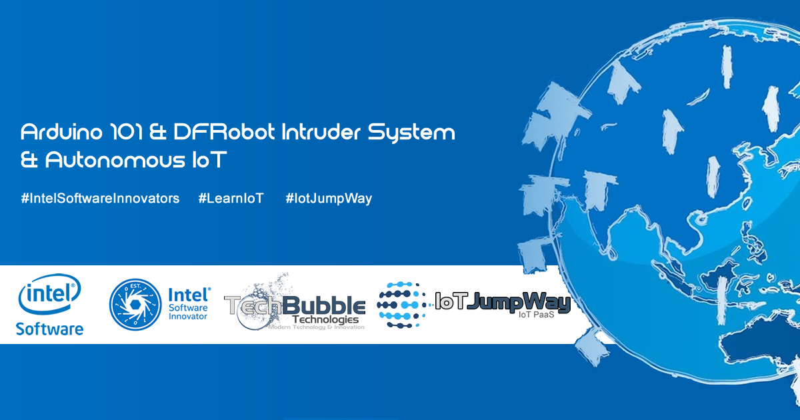
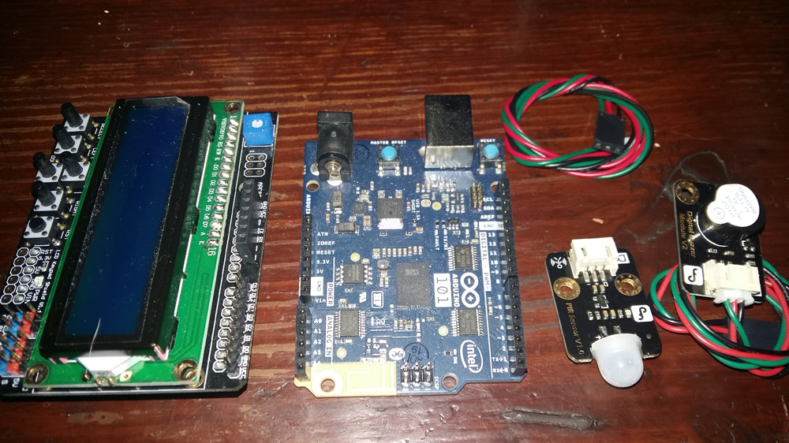
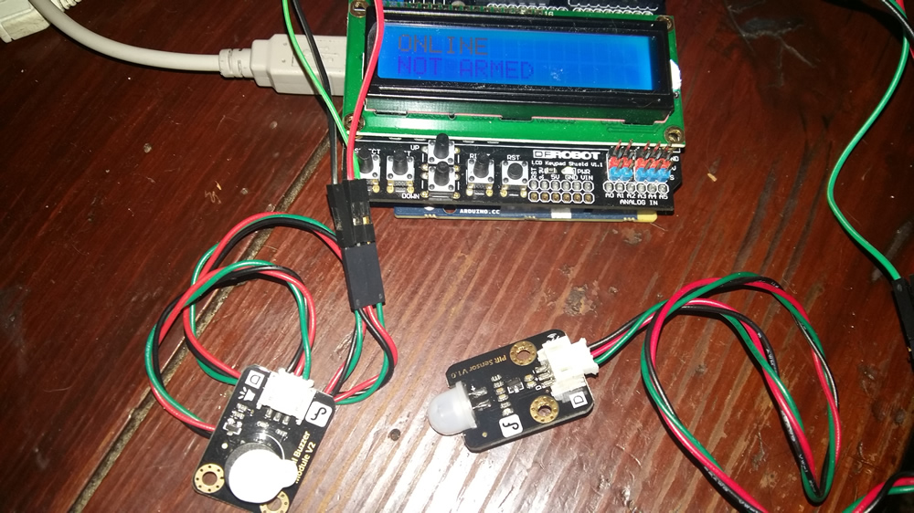
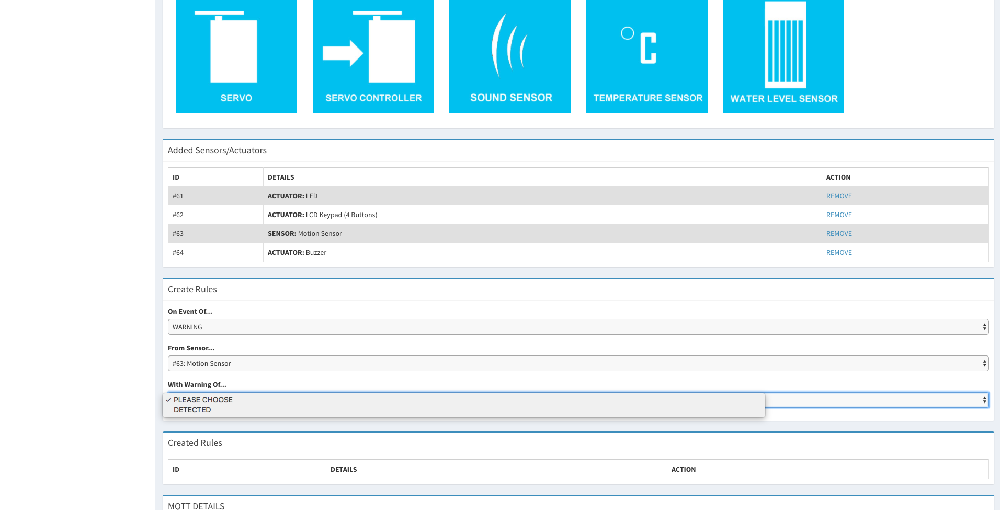

# IoT JumpWay Intel® Arduino/Genuino 101 DFRobot LCD Intruder System Example

  

## Introduction

Here you will find sample device scripts for connecting Intel® Arduino/Genuino 101 and DFRobot LCD Keypad Shield to the TechBubble Technologies IoT JumpWay using the Python MQTT Serial Library. The codes allow you to set up am intruder alarm system that is controlled by the DFRobot LCD Keypad Shield and the IoT JumpWay and communication via the IoT JumpWay. In addition to using the LCD Keypad Shield to arm and disarm the system / turn on and off the alarm, you can also use an application or autonomous device communication via the IoT JumpWay to switch the states of the buttons on the keypad.

Once you understand how it works you are free to add as many actuators and sensors to your device and modify your code accordingly.

##This project uses three applications:

1. A device application (Arduino) which communicates via serial with a Python Serial/MQTT application.
2. The Python Serial/MQTT application which communicates with the Arduino/Genuio 101 / DFRobot LCD Keypad Shield, and the IoT JumpWay.
3. A Python commands application / device application that can send commands to the device to toggle the state of the buttons. In this tutorial we will use the [Intel® Edison Dev Kit LED Python Example](https://github.com/TechBubbleTechnologies/IoT-JumpWay-Intel-Examples/tree/master/Intel-Edison/Dev-Kit-LED/Python "Intel® Edison Dev Kit LED Python Example") which has both a device application and commands application. (Optional)

## Python Versions

- 2.7 (Python Serial/MQTT application)
- 3.4 or above (Python commands application)

## Software requirements

1. [TechBubble IoT JumpWay Python MQTT Serial Library](https://github.com/TechBubbleTechnologies/IoT-JumpWay-Python-MQTT-Serial-Client "TechBubble IoT JumpWay Python MQTT Serial Library")
2. Arduino/Genuino IDE
3. ArduinoJson

## Hardware Requirements



1. Intel® Arduino/Genuino 101.
2. DFRobot LCD Keypad Shield
3. 1 x DFRobot Digital PIR Sensor Module
4. 1 x DFRobot Digital Buzzer Module
5. 4 x male / female jumper wires
6. 2 x male / male jumper wires

## Before You Begin

If this is the first time you have used the TechBubble IoT JumpWay in your IoT projects, you will require a developer account and some basics to be set up before you can start creating your IoT devices. Visit the following link and check out the guides that take you through registration and setting up your Location Space, Zones, Devices and Applications.

[TechBubble Technologies IoT JumpWay Developer Program (BETA) Docs](https://github.com/TechBubbleTechnologies/IoT-JumpWay-Docs/ "TechBubble Technologies IoT JumpWay Developer Program (BETA) Docs")

## Adding The Arduino/Genuino Board To Arduino IDE

        - Tools -> Boards -> Boards Manager
        - Search for Curie, or Intel Curie
        - Right click on the right hand side of the Curie section and install the latest version


## Install Requirements On Your PC & Arduino/Genuino 101

1. For the Python Serial/MQTT application we will need the [TechBubble IoT JumpWay Python MQTT Serial Library](https://github.com/TechBubbleTechnologies/IoT-JumpWay-Python-MQTT-Serial-Client "TechBubble IoT JumpWay Python MQTT Serial Library") installed on our PC/laptop/Mac. To Install the library, issue the following command on your chosen device:

    ```
        $ pip install iot_jumpway_mqtt_serial
    ```

2. Install the ArduinoJson library in the Arduino IDE:

    ```
        Sketch -> Include Library -> Manage Libraries
        Search for ArduinoJson
        Right click on the right hand side of the ArduinoJson section and install the latest version
    ```


## Setting Up Your Intel® Arduino/Genuino 101



First of all you need to connect up your DFRobot LCD Keypad Shield to your Intel® Arduino/Genuino 101 and connect your DFRobot PIR Sensor Module & DFRobot Buzzer Module. Follow the next steps to accomplish this.

1. Place the shield on top of your Arduino as in the image above. 
2. Connect 3 or your male / female jumper wires to on end of your DFRobot PIR sensor wires.
3. Connect the green wire to D2 on the DFRobot LCD Keypad Shield, red to VCC and black to GND.
4. Connect your final male / female jumper wire to the green DFRobot buzzer wire, and the 2 male / male wires to the red and black wires of the buzzer.
5. Connect the green wire to D3 on the DFRobot LCD Keypad Shield, red to VCC and black to GND.

## Device Connection Credentials & Actuator/Sensor Settings

- Follow the [TechBubble Technologies IoT JumpWay Developer Program (BETA) Location Device Doc](https://github.com/TechBubbleTechnologies/IoT-JumpWay-Docs/blob/master/4-Location-Devices.md "TechBubble Technologies IoT JumpWay Developer Program (BETA) Location Device Doc") to set up your main device. You will need to select the "LCD Keypad (4 Buttons)", "Motion Sensor" & "Buzzer" actuators/sensors whilst setting up your device in the developer console. If you want to use a second device to trigger autonomous communication, please follow the [Intel® Edison Dev Kit LED Python Example](https://github.com/TechBubbleTechnologies/IoT-JumpWay-Intel-Examples/tree/master/Intel-Edison/Dev-Kit-LED/Python "Intel® Edison Dev Kit LED Python Example") tutorial, we will show you how to set up the autonomous communication later in this tutorial.

  

- Download the [TechBubble IoT JumpWay Python MQTT Serial Library Application](https://github.com/TechBubbleTechnologies/IoT-JumpWay-Python-MQTT-Serial-Client/blob/master/application.py "TechBubble IoT JumpWay Python MQTT Serial Library Application") and the [TechBubble IoT JumpWay Python MQTT Serial Library Config File](https://github.com/TechBubbleTechnologies/IoT-JumpWay-Python-MQTT-Serial-Client/blob/master/config.json "TechBubble IoT JumpWay Python MQTT Serial Library Config File"), you can put them in a folder and name the folder something relevant so that you remember it, you will be able to reuse this application in the future for other tutorials. 

- Retrieve your connection credentials by following the link above, and update the config.json file with your new connection  credentials.

```
	"IoTJumpWaySettings": {
        "SystemLocation": 0,
        "SystemZone": 0,
        "SystemDeviceID": 0,
        "SystemDeviceName" : "Your Device Name",
        "SystemDeviceCom" : "Your Device Com Port"
    },
	"IoTJumpWayMQTTSettings": {
        "MQTTUsername": "Your Device MQTT Username",
        "MQTTPassword": "Your Device MQTT PASSWORD"
    }
```

- Open up the [IoT JumpWay Intel® Arduino/Genuino 101 DFRobot LCD Intruder System Example](https://github.com/TechBubbleTechnologies/IoT-JumpWay-Intel-Examples/blob/master/Intel-Arduino-101/3RD-PARTY-DFRobot/LCD-Intruder-System/LCD-Intruder-System.ino "IoT JumpWay Intel® Arduino/Genuino 101 DFRobot LCD Intruder System Example") and update the following lines with your DFRobot LCD Keypad Shield  & Module IDs retrieved from the steps above, then upload the sketch to your device:

    ```
        String JumpWaySensorType = "LCD Keypad";
        String JumpWaySensorID = "1";

        String JumpWaySensorType2 = "PIR Sensor";
        String JumpWaySensorID2 = "2";

        String JumpWaySensorType3 = "Buzzer";
        String JumpWaySensorID3 = "3";
    ```

- You may also need to alter the debounceWait variable if the buttons trigger multiple times.

    ```
        int debounceWait = 150;
    ```

## Execute The Python Program

As you have already uploaded your sketch, the program will now be running on your Arduino/Genuino 101. All that is left is to start the Python program with the following line:

    $ python NameOfYourSerialApplication.py 

## Autonomous Communication With Second Device

Each time you press a button, the device will send sensor data to the  [TechBubble IoT JumpWay](https://iot.techbubbletechnologies.com/ "TechBubble IoT JumpWay") and warning alerts will be sent when the motion sensor picks up date. You can use sensor valyes and warning messages to trigger autonomous communication with other devices you have connected to the IoT JumpWay. On the device edit page scroll down to the "Create Rules" section under the Actuators / Sensors. Here you can use the dropdown menu to create rules that allow your device email you or to autonomously communicate with other devices on its network in the event of status updates, sensor data and warnings.



## Control Via Command Application

[IoT JumpWay Developer Program (BETA) Location Applications](https://github.com/TechBubbleTechnologies/IoT-JumpWay-Docs/blob/master/5-Location-Applications.md "IoT JumpWay Developer Program (BETA) Location Applications") give you the ability to plug in control features for all devices connected to your IoT JumpWay Locations into your own applications. 

In this part of the tuturial we will focus on sending commands from our command application to replicate the buttons being pressed on the DFRobot LCD Keypad. This feature means that you could have an Android/iOS/web application and be anywhere in the world and be able to turn on/off whatever device you connected to the keyboard functions in the step above. 

Follow the next steps to set up your application:

1. We will be using the [IoT JumpWay Intel® Edison Dev Kit LED Example Application](https://github.com/TechBubbleTechnologies/IoT-JumpWay-Intel-Examples/blob/master/Intel-Edison/Dev-Kit-LED/Python/Dev-Kit-Led-Application.py "IoT JumpWay Intel® Edison Dev Kit LED Example Application") and the [IoT JumpWay Intel® Edison Dev Kit LED Example Config File](https://github.com/TechBubbleTechnologies/IoT-JumpWay-Intel-Examples/blob/master/Intel-Edison/Dev-Kit-LED/Python/config.json "IoT JumpWay Intel® Edison Dev Kit LED Example Config File"), you can put them in a folder and name the folder something relevant so that you remember it, you will be able to reuse this application in the future for other tutorials.

2. Update the device related configs with the credentials you created from this tutorial. This will mean that the application will no longer be sending control commands to the Edison Dev Kit LED device, but to the Python Serial/MQTT application we created in this tutorial which will, in turn, send the commands to the device and switch the buttons. You need to update the SystemZone, SystemDeviceID, SystemDeviceName and Actuators settings as below, the Actuator settings should match the ones you modified in the Arduino sketch above:

    ```
        "IoTJumpWaySettings": {
            "SystemLocation": 0,
            "SystemZone": 0,
            "SystemDeviceID": 0,
            "SystemDeviceName" : "Your Device Name",
            "SystemApplicationID": 0,
            "SystemApplicationName" : "Your Application Name"
        }

        "Actuators": {
            "LCD Keypad": {
                "ID": 1
            }
    ```

3. Finally you need to update the application itself. At the bottom of the application you will see the following code:

    ```
        DevKitLedApplication.JumpWayMQTTClient.publishToDeviceChannel(
            "Commands",
            DevKitLedApplication.configs["IoTJumpWaySettings"]["SystemZone"],
            DevKitLedApplication.configs["IoTJumpWaySettings"]["SystemDeviceID"],
            {
                "Actuator":"LED",
                "ActuatorID":DevKitLedApplication.configs["Actuators"]["LED"]["ID"],
                "Command":"TOGGLE",
                "CommandValue":"ON"
            }
        )
        
        time.sleep(5)
        
        DevKitLedApplication.JumpWayMQTTClient.publishToDeviceChannel(
            "Commands",
            DevKitLedApplication.configs["IoTJumpWaySettings"]["SystemZone"],
            DevKitLedApplication.configs["IoTJumpWaySettings"]["SystemDeviceID"],
            {
                "Actuator":"LED",
                "ActuatorID":DevKitLedApplication.configs["Actuators"]["LED"]["ID"],
                "Command":"TOGGLE",
                "CommandValue":"OFF"
            }
        )
    ```

4. Change that code to the following:

    ```
        DevKitLedApplication.JumpWayMQTTClient.publishToDeviceChannel(
            "Commands",
            DevKitLedApplication.configs["IoTJumpWaySettings"]["SystemZone"],
            DevKitLedApplication.configs["IoTJumpWaySettings"]["SystemDeviceID"],
            {
                "Actuator":"LCD Keypad",
                "ActuatorID":DevKitLedApplication.configs["Actuators"]["LCD Keypad"]["ID"],
                "Command":"TOGGLE",
                "CommandValue":"1"
            }
        )
        
        time.sleep(5)

        DevKitLedApplication.JumpWayMQTTClient.publishToDeviceChannel(
            "Commands",
            DevKitLedApplication.configs["IoTJumpWaySettings"]["SystemZone"],
            DevKitLedApplication.configs["IoTJumpWaySettings"]["SystemDeviceID"],
            {
                "Actuator":"LCD Keypad",
                "ActuatorID":DevKitLedApplication.configs["Actuators"]["LCD Keypad"]["ID"],
                "Command":"TOGGLE",
                "CommandValue":"2"
            }
        )
        
        time.sleep(5)

        DevKitLedApplication.JumpWayMQTTClient.publishToDeviceChannel(
            "Commands",
            DevKitLedApplication.configs["IoTJumpWaySettings"]["SystemZone"],
            DevKitLedApplication.configs["IoTJumpWaySettings"]["SystemDeviceID"],
            {
                "Actuator":"LCD Keypad",
                "ActuatorID":DevKitLedApplication.configs["Actuators"]["LCD Keypad"]["ID"],
                "Command":"TOGGLE",
                "CommandValue":"3"
            }
        )
        
        time.sleep(5)

        DevKitLedApplication.JumpWayMQTTClient.publishToDeviceChannel(
            "Commands",
            DevKitLedApplication.configs["IoTJumpWaySettings"]["SystemZone"],
            DevKitLedApplication.configs["IoTJumpWaySettings"]["SystemDeviceID"],
            {
                "Actuator":"LCD Keypad",
                "ActuatorID":DevKitLedApplication.configs["Actuators"]["LCD Keypad"]["ID"],
                "Command":"TOGGLE",
                "CommandValue":"4"
            }
        )
    ```

5. Start up the application with the following command, if the device and the Serial/MQTT applications are running, you will see the output in the Serial/MQTT application and the buttons 1 -4 will be triggered on the device, in turn, communicating with the device you connected up in the autonomous communication section above.

    ```
        sudo python/python3 Dev-Kit-Led-Application.py
    ```

## Viewing Your Data  

You will be able to access the data in the [TechBubble IoT JumpWay Developers Area](https://iot.techbubbletechnologies.com/developers/dashboard/ "TechBubble IoT JumpWay Developers Area"). Once you have logged into the Developers Area, visit the [TechBubble IoT JumpWay Location Devices Page](https://iot.techbubbletechnologies.com/developers/location-devices "Location Devices page"), find your device and then visit the Sensor/Actuator page to view the data sent from your device.


## HACKSTER

For Hackster community members you can follow this project on the IoT JumpWay Hub:

[Follow This Project On Hackster](https://www.hackster.io/AdamMiltonBarker/arduino-101-dfrobot-intruder-system-autonomous-iot-8e3373 "Follow This Project On Hackster")

## IoT JumpWay Intel® Arduino/Genuino 101 Examples Bugs/Issues

Please feel free to create issues for bugs and general issues you come across whilst using the IoT JumpWay Intel® Arduino/Genuino 101 Examples. You may also use the issues area to ask for general help whilst using the IoT JumpWay Intel® Arduino/Genuino 101 Examples in your IoT projects.

## IoT JumpWay Intel® Arduino/Genuino 101 Examples Contributors

- [Adam Milton-Barker, TechBubble Technologies Founder](https://github.com/AdamMiltonBarker "Adam Milton-Barker, TechBubble Technologies Founder")

  