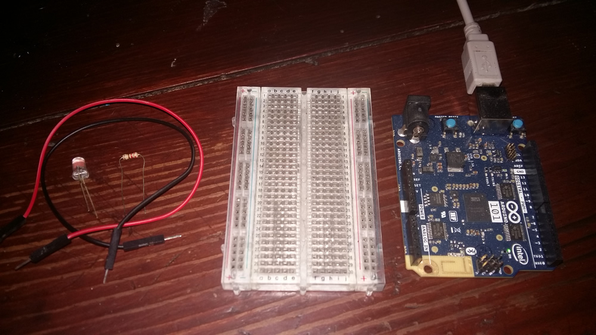
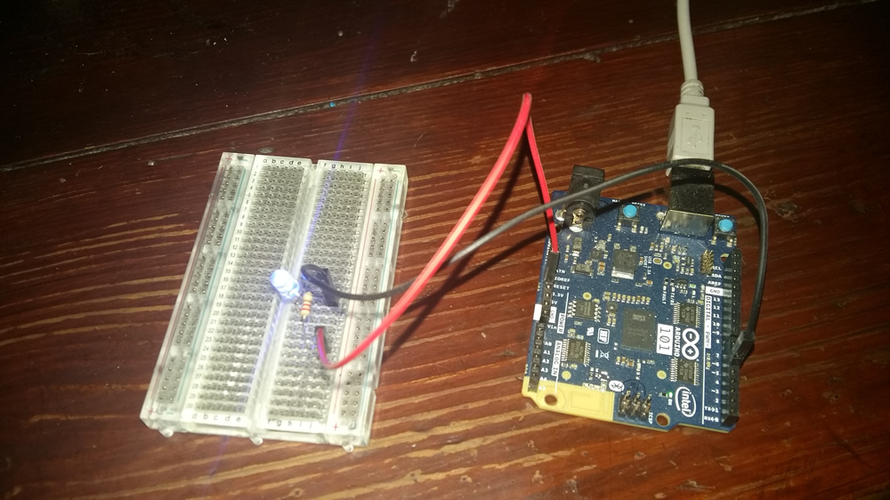

# IoT JumpWay Intel® Arduino/Genuino 101 Basic LED Example

  

## Introduction

Here you will find sample device scripts for connecting Intel® Arduino/Genuino 101 to the TechBubble Technologies IoT JumpWay  using the Python MQTT Serial Library. The codes allow you to set up a basic device that allows control of an LED, and an application to communicate with the device / IoT JumpWay, and make the LED flash on and off. Once you understand how it works you are free to add as many actuators and sensors to your device and modify your code accordingly.

This project uses three applications:

1. A device application (Arduino) which communicates via serial with a Python Serial/MQTT application.
2. The Python Serial/MQTT application which communicates with the Arduino/Genuio 101 and the IoT JumpWay.
3. A Python MQTT application that sends commands to Arduino/Genuino 101 via the IoT JumpWay and the Python Serial/MQTT application.

## Python Versions

- 2.7
- 3.4 or above

## Software requirements

1. iot_jumpway_mqtt_serial
2. Arduino/Genuino IDE
2. ArduinoJson

## Hardware Requirements



1. Intel® Arduino/Genuino 101.
2. 1 x LED.
3. 1 x 220 ohm Resistor
4. 2 x Jumper Wires
5. 1 x Breadboard

## Before You Begin

If this is the first time you have used the TechBubble IoT JumpWay in your IoT projects, you will require a developer account and some basics to be set up before you can start creating your IoT devices. Visit the following link and check out the guides that take you through registration and setting up your Location Space, Zones, Devices and Applications.

[TechBubble Technologies IoT JumpWay Developer Program (BETA) Docs](https://github.com/TechBubbleTechnologies/IoT-JumpWay-Docs/ "TechBubble Technologies IoT JumpWay Developer Program (BETA) Docs")

## Adding The Arduino/Genuino Board To Arduino IDE

        - Tools -> Boards -> Boards Manager
        - Search for Curie, or Intel Curie
        - Right click on the right hand side of the Curie section and install the latest version


## Install Requirements On Your PC & Arduino/Genuino 101

1. Install the iot_jumpway_mqtt_serial library:

    ```
        $ pip install iot_jumpway_mqtt_serial
    ```

2. Install the ArduinoJson library in the Arduino IDE:

    ```
        Sketch -> Include Library -> Manage Libraries
        Search for ArduinoJson
        Right click on the right hand side of the ArduinoJson section and install the latest version
    ```


## Setting Up Your Intel® Arduino/Genuino 101



First of all you need to connect up an LED to your Intel® Arduino/Genuino 101. To connect the LED you will need a breadboard, a 220 ohm resistor, and two jumper wires. 

1. Place the LED on your breadboard.
2. Connect the short leg of the LED to pin 5 of your Intel® Arduino/Genuino 101 using a jumper wire.
3. Connect one end of the resistor to the long leg of your LED.
4. Connect the other end of the resistor to the 3v output of the Intel® Arduino/Genuino 101.

## Device Connection Credentials & Actuator Settings

- Follow the [TechBubble Technologies IoT JumpWay Developer Program (BETA) Location Device Doc](https://github.com/TechBubbleTechnologies/IoT-JumpWay-Docs/blob/master/4-Location-Devices.md "TechBubble Technologies IoT JumpWay Developer Program (BETA) Location Device Doc") to set up your device, and the [TechBubble Technologies IoT JumpWay Developer Program (BETA) Location Application Doc](https://github.com/TechBubbleTechnologies/IoT-JumpWay-Docs/blob/master/5-Location-Applications.md "TechBubble Technologies IoT JumpWay Developer Program (BETA) Location Application Doc") to set up your MQTT application, you will need the MQTT application to communicate with your serial application further on in the tutorial. 

  

- Download the [TechBubble IoT JumpWay Python MQTT Serial Library Application](https://github.com/TechBubbleTechnologies/IoT-JumpWay-Python-MQTT-Serial-Client/blob/master/application.py "TechBubble IoT JumpWay Python MQTT Serial Library Application") and the [TechBubble IoT JumpWay Python MQTT Serial Library Config File](https://github.com/TechBubbleTechnologies/IoT-JumpWay-Python-MQTT-Serial-Client/blob/master/config.json "TechBubble IoT JumpWay Python MQTT Serial Library Config File"), retrieve your connection credentials by following the link above, and update the config.json file with your new connection  credentials and actuator (LED) setting.

```
	"IoTJumpWaySettings": {
        "SystemLocation": 0,
        "SystemZone": 0,
        "SystemDeviceID": 0,
        "SystemDeviceName" : "Your Device Name",
        "SystemDeviceCom" : "Your Device Com Port"
    },
	"IoTJumpWayMQTTSettings": {
        "MQTTUsername": "Your Device MQTT Username",
        "MQTTPassword": "Your Device MQTT PASSWORD"
    }
```

- Open up the [Arduino/Genuino 101 Basic LED Example](https://github.com/TechBubbleTechnologies/IoT-JumpWay-Intel-Examples/blob/master/Intel-Arduino-101/Basic-LED/Basic-LED.ino "Arduino/Genuino 101 Basic LED Example") and update the following line with your LED actuator ID retrieved from the steps above, then upload the sketch to your device:

    ```
        const int actuator1JumpWayID = 0;
    ```

## Execute The Python Program

As you have already uploaded your sketch, the program will now be running on your Arduino/Genuino 101. All that is left is to start the Python program with the following line:

    $ python NameOfYourSerialApplication.py 

## Control Your Device With Your MQTT Application

Now it is time to set up your MQTT application mentioned in the steps above.

1. For this application you can use the application and config file from the [IoT JumpWay Intel® Arduino/Genuino 101 Basic LED Example](https://github.com/TechBubbleTechnologies/IoT-JumpWay-Intel-Examples/tree/master/Intel-Arduino/Genuino 101/Basic-LED/Python "IoT JumpWay Intel® Arduino/Genuino 101 Basic LED Example").

2. Use the application information you received from steps above to fill out the details below:

    ```
        "IoTJumpWaySettings": {
            "SystemLocation": 0,
            "SystemZone": 0,
            "SystemDeviceID": 0,
            "SystemDeviceName" : "Your Device Name",
            "SystemApplicationID": 0,
            "SystemApplicationName" : "Your Application Name"
        }
    ```

    ```
        "IoTJumpWayMQTTSettings": {
            "username": "Your Device MQTT Username",
            "password": "Your Device MQTT Password",
            "applicationUsername": "Your Application MQTT Username",
            "applicationPassword": "Your Application MQTT Password"
        }
    ```

## Execute The Python Program

Now all you have to do is execute your MQTT application. This application sends a device command to turn on your LED through the IoT JumpWay to your serial application, which inturn sends the command via serial to the relevant actuator on your Arduino/Genuino 101, in this case, your LED:

    $ python/python3 NameOfYourMQTTApplication.py

## Viewing Your Data  

Each time your device detects a person or an intruder, it will send data to the [TechBubble IoT JumpWay](https://iot.techbubbletechnologies.com/ "TechBubble IoT JumpWay"). You will be able to access the data in the [TechBubble IoT JumpWay Developers Area](https://iot.techbubbletechnologies.com/developers/dashboard/ "TechBubble IoT JumpWay Developers Area"). Once you have logged into the Developers Area, visit the [TechBubble IoT JumpWay Location Devices Page](https://iot.techbubbletechnologies.com/developers/location-devices "Location Devices page"), find your device and then visit the Sensor/Actuator page and the Warnings page to view the data sent from your device.


## IoT JumpWay Intel® Arduino/Genuino 101 Examples Bugs/Issues

Please feel free to create issues for bugs and general issues you come across whilst using the IoT JumpWay Intel® Arduino/Genuino 101 Examples. You may also use the issues area to ask for general help whilst using the IoT JumpWay Intel® Arduino/Genuino 101 Examples in your IoT projects.

## IoT JumpWay Intel® Arduino/Genuino 101 Examples Contributors

- [Adam Milton-Barker, TechBubble Technologies Founder](https://github.com/AdamMiltonBarker "Adam Milton-Barker, TechBubble Technologies Founder")

  