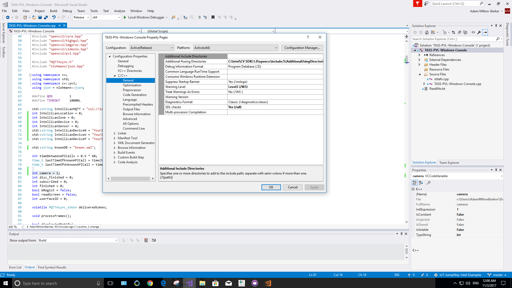
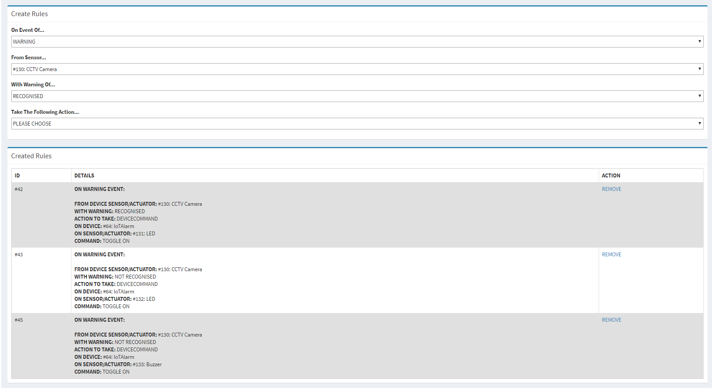

# IoT JumpWay Intel® Computer Vision SDK Windows Console TASS PVL RealSense Security System


## Introduction

Here you will find a sample application for TASS PVL, a Computer Vision security system using Intel® Computer Vision SDK, an Intel® Realsense camera and an Intel® Edison connected to the Internet of Things via TechBubble Technologies IoT JumpWay.

Once you understand how it works you are free to modify the app accordingly.

## This project uses two applications:

1. A Windows Computer Vision application.
2. A Node JS application on an Intel® Edison that receives commands to activate LEDs and a buzzer when known or unknown faces are detected

## Software requirements

1. [Intel® Computer Vision SDK for Windows 10](https://github.com/TechBubbleTechnologies/IoT-JumpWay-Intel-Examples/blob/master/Intel-Computer-Vision-SDK/TASS-PVL/Windows/_Docs/1-Installing-Intel-CV-SDK.md "Intel® Computer Vision SDK for Windows 10")

2. [Intel® RealSense SDK for Windows 10](https://github.com/TechBubbleTechnologies/IoT-JumpWay-Intel-Examples/blob/master/Intel-Computer-Vision-SDK/TASS-PVL/Windows/_Docs/2-Installing-Intel-RealSense-SDK.md "Intel® RealSense SDK for Windows 10")

3. [Microsoft Vcpkg](https://github.com/Microsoft/vcpkg "Microsoft Vcpkg"), Paho, Json

4. [Node JS](https://nodejs.org/en/download/ "Node JS")

5. [Visual Studio 2017](https://www.visualstudio.com/downloads/ "Visual Studio 2017")

## Hardware requirements

1. Windows PC with 6th Generation Intel® Core™ Processors with Intel® Iris® Pro Graphics and HD Graphics, In our example we are using an Intel® NUC NUC7i7BNH with Intel® OPtane Memory.

2. 1 x Realsense camera (Tested with F200 & R200)

3. 1 x Intel® Edison

4. 1x Grove starter kit plus - Intel IoT Edition for Intel® Edison

5. 1 x Blue LED (Grove)

6. 1 x Red LED (Grove)

7. 1 x Buzzer (Grove)

8. 1 x Webcam

## Before You Begin

There are a few tutorials that you should follow before beginning, especially if it is the first time you have used the TechBubble IoT JumpWay Developer Program. If you do not already have one, you will require a TechBubble IoT JumpWay Developer Program developer account, and some basics to be set up before you can start creating your IoT devices. Visit the following [IoT JumpWay Developer Program Docs (5-10 minute read/setup)](https://github.com/TechBubbleTechnologies/IoT-JumpWay-Docs/ "IoT JumpWay Developer Program Docs (5-10 minute read/setup)") and check out the guides that take you through registration and setting up your Location Space, Zones, Devices and Applications (About 5 minutes read).

## Preparing Your Windows Device

- [Install Intel® Computer Vision SDK](https://github.com/TechBubbleTechnologies/IoT-JumpWay-Intel-Examples/blob/master/Intel-Computer-Vision-SDK/TASS-PVL/Windows/_Docs/1-Installing-Intel-CV-SDK.md "Install Intel® Computer Vision SDK")

- [Install Intel® RealSense SDK](https://github.com/TechBubbleTechnologies/IoT-JumpWay-Intel-Examples/blob/master/Intel-Computer-Vision-SDK/TASS-PVL/Windows/_Docs/2-Installing-Intel-RealSense-SDK.md "Install Intel® RealSense SDK")

- [Install Microsoft Vcpkg](https://github.com/Microsoft/vcpkg "Install Microsoft Vcpkg"), Paho, Json

- [Install Visual Studio 2017](https://www.visualstudio.com/downloads/ "Install Visual Studio 2017")

- Install Paho MQTT

    ```
    C:\src\vcpkg> vcpkg install paho-mqtt:x64-windows
    ```

    Once installed, edit the MQTTAsync.h and MQTTClient.h files in C:\src\vcpkg\installed\x64-windows\include.

    Change:

    ```
    #if defined(WIN32) || defined(WIN64)
        #define DLLImport __declspec(dllimport)
        #define DLLExport __declspec(dllexport)
    #else
        #define DLLImport extern
        #define DLLExport  __attribute__ ((visibility ("default")))
    #endif
    ```

    To:

    ```
    #if defined(_WIN32) || defined(_WIN64)
        #define DLLImport __declspec(dllimport)
        #define DLLExport __declspec(dllexport)
    #else
        #define DLLImport extern
        #define DLLExport  __attribute__ ((visibility ("default")))
    #endif
    ```

- Install Nlohmann Json

    ```
    C:\src\vcpkg> vcpkg install nlohmann-json:x64-windows
    ```

- Plug In Your Realsense Camera 

    Plug in your Realsense camera and make sure that you have all of the relevant drivers installed for your machine to recognise the device, remember that Realsense requires USB3 and will not work on USB2.

## Cloning The Repo

You will need to clone this repository to a location on your Intel® Edison. Navigate to the directory you would like to download it to and issue the following command, or use the Windows GitHub GUI.

    C:\YourChosenLocation> git clone https://github.com/TechBubbleTechnologies/IoT-JumpWay-Intel-Examples.git

## IoT JumpWay Device Connection Credentials & Settings

- Follow the [TechBubble Technologies IoT JumpWay Developer Program (BETA) Location Application Doc](https://github.com/TechBubbleTechnologies/IoT-JumpWay-Docs/blob/master/5-Location-Applications.md "TechBubble Technologies IoT JumpWay Developer Program (BETA) Location Application Doc") to set up your IoT JumpWay Location Application.

- Setup an IoT JumpWay Location Device for TASS PVL, ensuring you set up you camera node,as you will need the ID of the camera for the project to work. Once your create your device, make sure you note the MQTT username and password, the device ID and device name exactly, you will also need the zone and location ID. You will need to edit your device and add the rules that will allow it to communicate autonomously with the Intel Edison, but for now, these are the only steps that need doing at this point.

Follow the [TechBubble Technologies IoT JumpWay Developer Program (BETA) Location Device Doc](https://github.com/TechBubbleTechnologies/IoT-JumpWay-Docs/blob/master/4-Location-Devices.md "TechBubble Technologies IoT JumpWay Developer Program (BETA) Location Device Doc") to set up your devices.


- Locate and update the following code in TASS-PVL-Windows-Console.cpp, and replace with your device settings.

```
    int IntelliLanLocation = 0;
    int IntelliLanZone = 0;
    int IntelliLanDevice = 0;
    int IntelliLanSensor = 0;
    std::string IntelliLanDeviceN = "YourIoTJumpWayDeviceNameHere";
    std::string IntelliLanDeviceU = "YourIoTJumpWayDeviceUsernameHere";
    std::string IntelliLanDeviceP = "YourIoTJumpWayDevicePasswordHere";
```

## Additional Include Directories & Library Directories

If you installed the Intel® Computer Vision SDK to any directory other than the default (C:\Intel\CV SDK\), or if you installed RealSense to a different directory other than the default (C:\Program Files (x86)\Intel\RSSDK) you will need to update the Additional Include Directories & Library Directories settings to reflect your installed location. 




## Setting Up Your Intel® Edison


The next step is to set up your Intel® Edison so that TASS PVL can communicate with it via the IoT JumpWay. For this, we already created a tutorial, the IoT JumpWay Intel® Edison Dev Kit IoT Alarm, that will guide you through this process. The only difference is that you do not need to set up the Python commands application, as in this project, TASS PVL will replace the Python commands application, to save time, please only follow the steps for the Intel® Edison device Node JS application. 

You will find the tutorial on the following link: 

[IoT JumpWay Intel® Edison Dev Kit IoT Alarm](https://github.com/TechBubbleTechnologies/IoT-JumpWay-Intel-Examples/tree/master/Intel-Edison/Dev-Kit-IoT-Alarm/NodeJS "IoT JumpWay Intel® Edison Dev Kit IoT Alarm")

Once you have completed that tutorial and have your device setup, return he to complete the final integration steps.

## Setting Up Your Rules

You are now ready to take the final steps, at this point you should have everything set up and your Intel® Edison Dev Kit IoT Alarm should be running and connected to the IoT JumpWay waiting for instructions. 

Next we are going to set up the rules that allow TASS PVL to control your Intel® Edison Dev Kit IoT Alarm autonomously. Go back to the TAS PVL device page and make sure you are on the edit page. Scroll down to below where you added the camera node and you will see you are able to add rules. 



The rules that we want to add are as follows:

1. When a known person is identified, turn on the blue LED.

2. When an unknown person is identified, turn on the red LED.

3. When an unknown person is identified, turn on the buzzer.

The events are going be triggered by warning messages sent from TASS PVL, so in the On Event Of drop down, select WARNING. Then you need to select the camera node you added to the TASS PVL device, as this is the sensor that the warning will come from. Next choose RECOGNISED in the With Warning Of, which will mean that the rule will be triggered when the IoT JumpWay receives a warning message that a known person has been identified, then select the Send Device Command for the Take The Following Action section, choose the Intel® Edison as the device, the blue LED as the sensor, toggle as the action and on as the command. This will then tell the Edison to turn on the blue light in the event of a known person being detected. 

You should repeat these steps for the red LED and buzzer for the event of NOT RECOGNISED to handle events where an intruder, or unknown person is identified. 

## Ready To Go!

And that is it, if you have followed the tutorials correctly, you are now ready to fire up your new security system. Run the Windows console application to begin, and you will see the console window open up and a live stream of your camera, complete with bounding box and emotion status if happy. To train a known user, you simply need them to stand in front of the camera and click R to register their face, and S to save. 

## Viewing Your Data

When the program detects a known user or intruder, it will send sensor and warning data for the device it was captured from to the [TechBubble IoT JumpWay](https://iot.techbubbletechnologies.com/ "TechBubble IoT JumpWay"). You will be able to access the data in the [TechBubble IoT JumpWay Developers Area](https://iot.techbubbletechnologies.com/developers/dashboard/ "TechBubble IoT JumpWay Developers Area"). Once you have logged into the Developers Area, visit the [TechBubble IoT JumpWay Location Devices Page](https://iot.techbubbletechnologies.com/developers/location-devices "Location Devices page"), find your device and then visit the Warnings & Sensor Data pages to view the data sent from the application.


## IoT JumpWay Intel® Computer Vision SDK Bugs/Issues

Please feel free to create issues for bugs and general issues you come across whilst using the IoT JumpWay Intel® Examples. You may also use the issues area to ask for general help whilst using the IoT JumpWay Intel® Examples in your IoT projects.

## IoT JumpWay Intel® Computer Vision SDK Contributors

- [Adam Milton-Barker, TechBubble Technologies Founder](https://github.com/AdamMiltonBarker "Adam Milton-Barker, TechBubble Technologies Founder")

