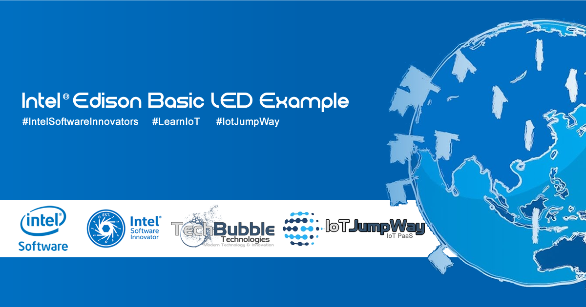
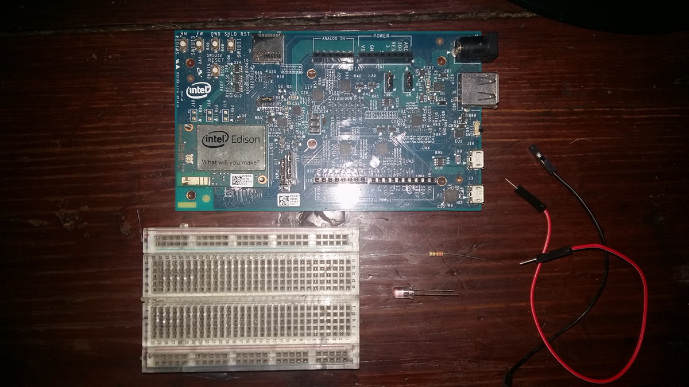
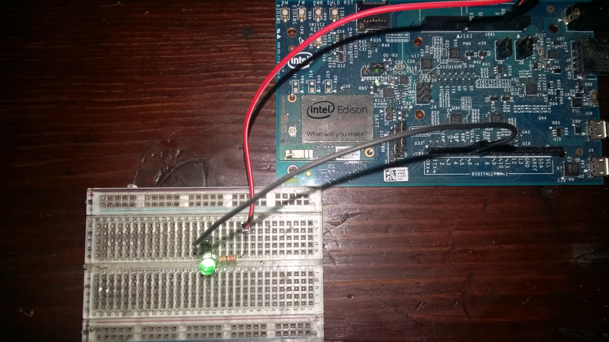
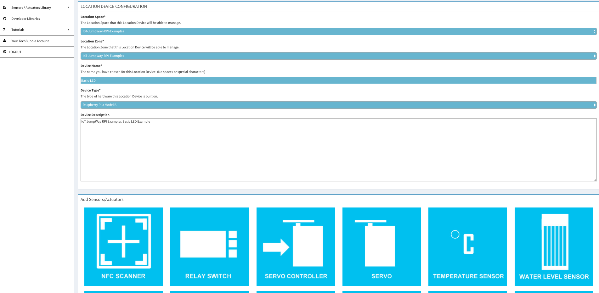
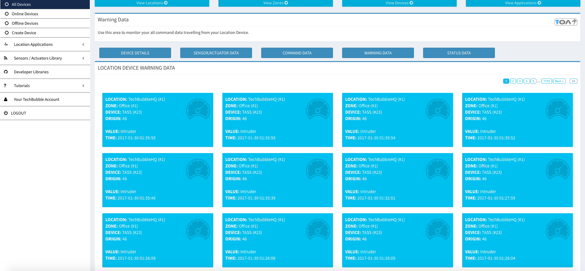

# IoT JumpWay Intel® Edison Basic LED Example

  

## Introduction

Want to take your first steps into the magical world of the Internet of Things, or want to find out how easy it is to use the IoT JumpWay as your secure IoT communication platform? This tutorial is for you an will hold your hand through setting up your first Intel® Edison project powered by the TechBubble IoT JumpWay.

This tutorial is a simple tutorial that will help you take your first steps to using the TechBubble IoT JumpWay to connect your IoT devices and applications to the Internet of Things.

The tutorial will use TechBubble Technologies IoT JumpWay Python MQTT Library for communication, an Intel® Edison with an added LED, and an application that can control the LED via the IoT JumpWay.

## Python Versions

- 2.7
- 3.4 or above

## Software requirements

1. [TechBubble IoT JumpWay Python MQTT Client](https://github.com/TechBubbleTechnologies/IoT-JumpWay-Python-MQTT-Clients "TechBubble IoT JumpWay Python MQTT Client")  

## Hardware requirements



1. Intel® Edison.
2. 1 x LED.
3. 1 x 220 ohm Resistor
4. 2 x Jumper Wires
5. 1 x Breadboard

## Before You Begin

There are a few tutorials that you should follow before beginning, especially if it is the first time you have followed any of our Raspberry Pi tutorials or if it is the first time you have used the TechBubble IoT JumpWay Developer Program. If this is the first time you have used the TechBubble IoT JumpWay in your IoT projects, you will require a developer account and some basics to be set up before you can start creating your IoT devices. Visit the following [IoT JumpWay Developer Program Docs (5-10 minute read/setup)](https://github.com/TechBubbleTechnologies/IoT-JumpWay-Docs/ "IoT JumpWay Developer Program Docs (5-10 minute read/setup)") and check out the guides that take you through registration and setting up your Location Space, Zones, Devices and Applications (About 5 minutes read).

- [Intel® Edison Security](https://github.com/TechBubbleTechnologies/IoT-JumpWay-Intel-Examples/blob/master/Intel-Edison/DOCS/1-Security.md "Intel® Edison Security")

- [Intel® Edison Booting From SD (Linux)](https://github.com/TechBubbleTechnologies/IoT-JumpWay-Intel-Examples/blob/master/Intel-Edison/_DOCS/1-Booting-From-SD-Linux.md "Intel® Edison Booting From SD (Linux)")

## Preparing Your Intel® Edison

To help secure your Intel® Edison, follow the [Intel® Edison Security](https://github.com/TechBubbleTechnologies/IoT-JumpWay-Intel-Examples/blob/master/Intel-Edison/DOCS/1-Security.md "Intel® Edison Security") and the  [Intel® Edison Booting From SD (Linux)](https://github.com/TechBubbleTechnologies/IoT-JumpWay-Intel-Examples/blob/master/Intel-Edison/_DOCS/1-Booting-From-SD-Linux.md "Intel® Edison Booting From SD (Linux)") guides.

## Cloning The Repo

You will need to clone this repository to a location on your Intel® Edison. Navigate to the directory you would like to download it to and issue the following commands.

    $ git clone https://github.com/TechBubbleTechnologies/IoT-JumpWay-Intel-Examples.git

## Install Requirements

    $ cd IoT-JumpWay-Intel-Examples/Basic-LED/Python
    $ pip install --upgrade pip
    $ pip install -r requirements.txt

## Setting Up Your Edison



First of all you need to connect up an LED to your Intel® Edison. To connect the LED you will need a breadboard, a 220 ohm resistor, and two jumper wires. 

1. Place the LED on your breadboard.
2. Connect the short leg of the LED to pin 5 of your Intel® Edison using a jumper wire.
3. Connect one end of the resistor to the long leg of your LED.
4. Connect the other end of the resistor to the 3v output of the Intel® Edison.

## Device / Application Connection Credentials & Sensor Settings

- Follow the [TechBubble Technologies IoT JumpWay Developer Program (BETA) Location Device Doc](https://github.com/TechBubbleTechnologies/IoT-JumpWay-Docs/blob/master/4-Location-Devices.md "TechBubble Technologies IoT JumpWay Developer Program (BETA) Location Device Doc") to set up your device, and the [TechBubble Technologies IoT JumpWay Developer Program (BETA) Location Application Doc](https://github.com/TechBubbleTechnologies/IoT-JumpWay-Docs/blob/master/5-Location-Applications.md "TechBubble Technologies IoT JumpWay Developer Program (BETA) Location Application Doc") to set up your application. 

  

- Retrieve your connection credentials and update the config.json file with your new connection  credentials and actuator (LED) setting.

```
	"Actuators": {
		"LED": {
			"ID": 0,
			"PIN": 5
		}
	}
```

```
	"IoTJumpWaySettings": {
        "SystemLocation": 0,
        "SystemZone": 0,
        "SystemDeviceID": 0,
        "SystemDeviceName" : "Your Device Name",
        "SystemApplicationID": 0,
        "SystemApplicationName" : "Your Application Name"
	}
```

```
	"IoTJumpWayMQTTSettings": {
        "host": "https://iot.techbubbletechnologies.com",
        "port": "8883",
        "username": "Your Device MQTT Username",
        "password": "Your Device MQTT Password",
        "applicationUsername": "Your Application MQTT Username",
        "applicationPassword": "Your Application MQTT Password"
	}
```

## Execute The Programs

    $ sudo python/python3 Basic-Led-Device.py 
    $ sudo python/python3 Basic-Led-Application.py 

## Viewing Your Data  

Each command sent to the device is stored in the [TechBubble IoT JumpWay](https://iot.techbubbletechnologies.com/ "TechBubble IoT JumpWay"). You will be able to access the data in the [TechBubble IoT JumpWay Developers Area](https://iot.techbubbletechnologies.com/developers/dashboard/ "TechBubble IoT JumpWay Developers Area"). Once you have logged into the Developers Area, visit the [TechBubble IoT JumpWay Location Devices Page](https://iot.techbubbletechnologies.com/developers/location-devices "Location Devices page"), find your device and then visit the Commands Data page to view the data sent from your device.




## IoT JumpWay Intel® Edison Examples Bugs/Issues

Please feel free to create issues for bugs and general issues you come across whilst using the IoT JumpWay Intel® Edison Examples. You may also use the issues area to ask for general help whilst using the IoT JumpWay Intel® Edison Examples in your IoT projects.

## IoT JumpWay Intel® Edison Examples Contributors

- [Adam Milton-Barker, TechBubble Technologies Founder](https://github.com/AdamMiltonBarker "Adam Milton-Barker, TechBubble Technologies Founder")

  