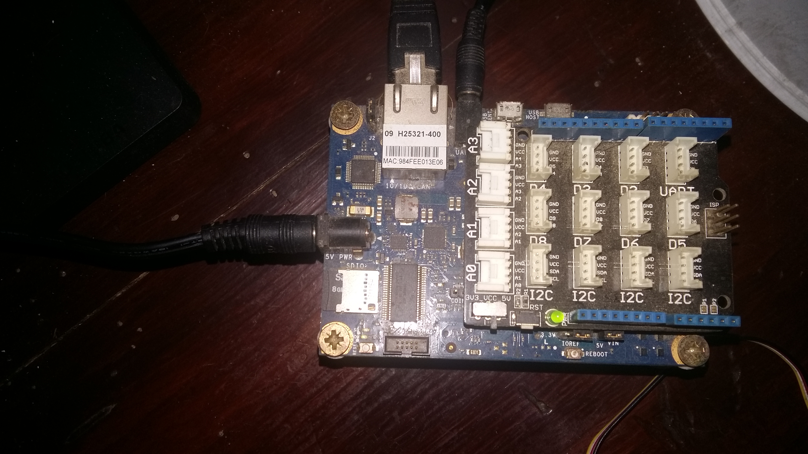
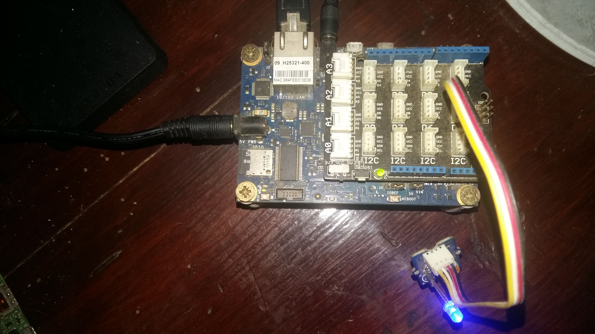
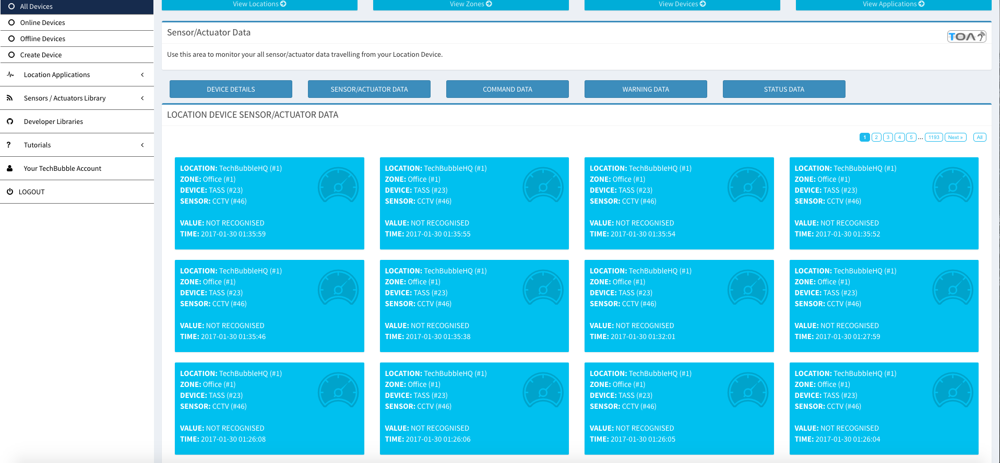

# IoT JumpWay Intel Galileo Gen 1 Dev Kit LED Example

  

## Introduction

Here you will find sample device scripts for connecting Intel Galileo Gen 1 and IoT Dev Kit to the TechBubble Technologies IoT JumpWay using the Python MQTT Library. The codes allow you to set up a basic device that allows control of an LED, and an application to communicate with the device and make the LED flash on and off. Once you understand how it works you are free to add as many actuators and sensors to your device and modify your code accordingly.

## Python Versions

- 2.7
- 3.4 or above

## Software requirements

1. TechBubbleIoTJumpWayMQTT  
2. JSon

## Hardware Requirements



1. Intel Galileo Gen 1.
2. Grove starter kit plus - Intel IoT Edition for Intel Galileo Gen 1.
3. 1 x LED.

## Before You Begin

If this is the first time you have used the TechBubble IoT JumpWay in your IoT projects, you will require a developer account and some basics to be set up before you can start creating your IoT devices. Visit the following link and check out the guides that take you through registration and setting up your Location Space, Zones, Devices and Applications.

[TechBubble Technologies IoT JumpWay Developer Program (BETA) Docs](https://github.com/TechBubbleTechnologies/IoT-JumpWay-Docs/ "TechBubble Technologies IoT JumpWay Developer Program (BETA) Docs")

## Preparing Your Intel Galileo Gen 1

To help secure your Intel Galileo Gen 1, follow the [Intel Galileo Security](https://github.com/TechBubbleTechnologies/IoT-JumpWay-Intel-Examples/blob/master/Intel-Galileo/DOCS/1-Security.md "Intel Galileo Security") guide.

## Cloning The Repo

You will need to clone this repository to a location on your Raspberry Pi 3. Navigate to the directory you would like to download it to and issue the following commands.

    $ git clone https://github.com/TechBubbleTechnologies/IoT-JumpWay-Intel-Examples.git

## Install Requirements

    $ cd IoT-JumpWay-Intel-Examples/Intel-Galileo/Dev-Kit-LED/Python
    $ pip install --upgrade pip
    $ pip install -r requirements.txt

## Setting Up Your Intel Galileo Gen 1



First of all you need to connect up an LED to your Intel Galileo Gen 1. To connect the LED you will need an , a 220 ohm resistor, and two jumper wires. 

1. Connect the IoT Dev Kit to your Intel Galileo Gen 1.
2. Connect the LED to pin D5 of your IoT Dev Kit.

## Device / Application Connection Credentials & Sensor Settings

- Follow the [TechBubble Technologies IoT JumpWay Developer Program (BETA) Location Device Doc](https://github.com/TechBubbleTechnologies/IoT-JumpWay-Docs/blob/master/4-Location-Devices.md "TechBubble Technologies IoT JumpWay Developer Program (BETA) Location Device Doc") to set up your device, and the [TechBubble Technologies IoT JumpWay Developer Program (BETA) Location Application Doc](https://github.com/TechBubbleTechnologies/IoT-JumpWay-Docs/blob/master/5-Location-Applications.md "TechBubble Technologies IoT JumpWay Developer Program (BETA) Location Application Doc") to set up your application. 

  

- Retrieve your connection credentials and update the config.json file with your new connection  credentials and actuator (LED) setting.

```
	"Actuators": {
		"LED": {
			"ID": 0,
			"PIN": 5
		}
	}
```

```
	"IoTJumpWaySettings": {
        "SystemLocation": 0,
        "SystemZone": 0,
        "SystemDeviceID": 0,
        "SystemDeviceName" : "Your Device Name",
        "SystemApplicationID": 0,
        "SystemApplicationName" : "Your Application Name"
	}
```

```
	"IoTJumpWayMQTTSettings": {
        "host": "https://iot.techbubbletechnologies.com",
        "port": "8883",
        "username": "Your Device MQTT Username",
        "password": "Your Device MQTT Password",
        "applicationUsername": "Your Application MQTT Username",
        "applicationPassword": "Your Application MQTT Password"
	}
```

## Execute The Programs

    $ sudo python/python3 Dev-Kit-Led-Device.py 
    $ sudo python/python3 Dev-Kit-Led-Application.py 

## Viewing Your Data  

Each time your device detects a person or an intruder, it will send data to the [TechBubble IoT JumpWay](https://iot.techbubbletechnologies.com/ "TechBubble IoT JumpWay"). You will be able to access the data in the [TechBubble IoT JumpWay Developers Area](https://iot.techbubbletechnologies.com/developers/dashboard/ "TechBubble IoT JumpWay Developers Area"). Once you have logged into the Developers Area, visit the [TechBubble IoT JumpWay Location Devices Page](https://iot.techbubbletechnologies.com/developers/location-devices "Location Devices page"), find your device and then visit the Sensor/Actuator page and the Warnings page to view the data sent from your device.




## IoT JumpWay Intel Galileo Examples Bugs/Issues

Please feel free to create issues for bugs and general issues you come accross whilst using the IoT JumpWay Intel Galileo Examples. You may also use the issues area to ask for general help whilst using the IoT JumpWay Intel Galileo Examples in your IoT projects.

## IoT JumpWay Intel Galileo Examples Contributors

- [Adam Milton-Barker, TechBubble Technologies Founder](https://github.com/AdamMiltonBarker "Adam Milton-Barker, TechBubble Technologies Founder")