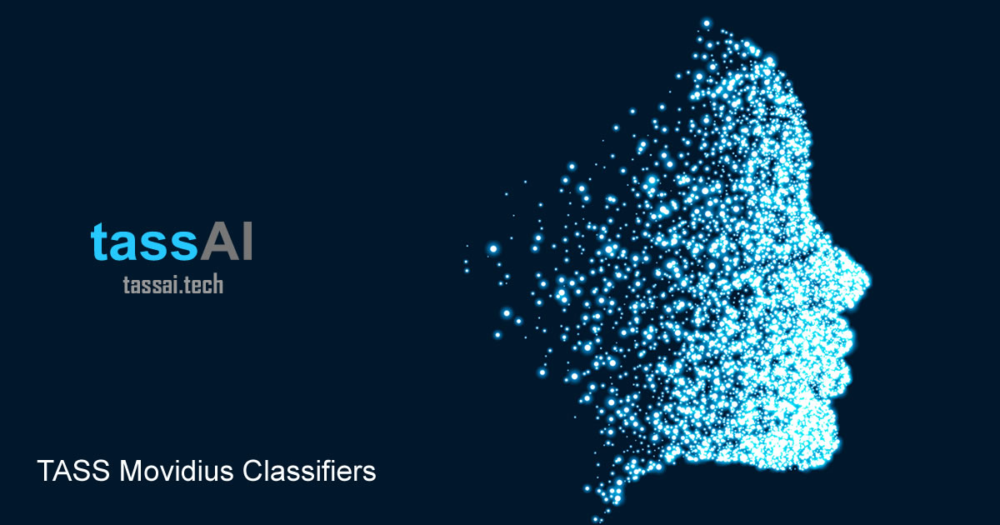

# IoT JumpWay Intel® Movidius Examples

## Introduction

Intel® Movidius™ VPUs drive the demanding workloads of  modern computer vision and AI applications at ultra-low power. By coupling highly parallel programmable compute with workload-specific hardware acceleration, and co-locating these components on a common intelligent memory fabric, Movidius achieves a unique balance of power efficiency and high performance. Movidius technology allows device makers to deploy deep neural network and computer vision applications in categories such as smartphones, drones, intelligent cameras and augmented reality devices.

- [Python: TASS Movidius Example](https://github.com/AdamMiltonBarker/IoT-JumpWay-Intel-Examples/tree/master/Intel-Movidius/TASS "Python: TASS Movidius Example"). Uses pretrained Inception V3 & Yolo models with an Intel® Movidius to carry out object and facial classification, both locally and on a live webcam stream.