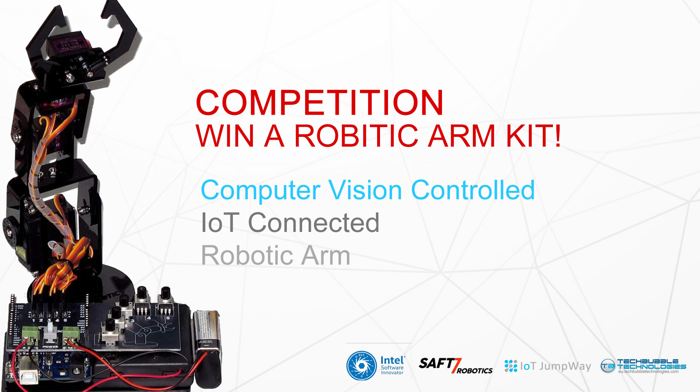

# Robotic Arm ESP8266 Communication Program



## Introduction

Here you will find the ESP8266 Communication Program that allows the robotic arm to talk to the IoT JumpWay. The codes allow you to set up a device that can connect to the Internet of Things and waits for commands sent to the arm, forwarding them to the arm via serial.

## Hardware Requirements

1. ESP8266

## Software requirements

1. ESP8266WiFi
2. PubSubClient MQTT  
3. ArduinoJson
4. WiFiClientSecure

## Connection Credentials

- Follow the [TechBubble Technologies IoT JumpWay Developer Program (BETA) Location Device Doc-](https://github.com/TechBubbleTechnologies/IoT-JumpWay-Docs/blob/master/4-Location-Devices.md "TechBubble Technologies IoT JumpWay Developer Program (BETA) Location Device Doc") to set up your device. 

- Add your WiFi credentials to the following code which will allow your ESP8266 to connect to the internet.

```
	const char* ssid = "YourSSID";
    const char* password = "YourWiFiPassword";
```

- Retrieve your connection credentials and update the config.json file with your new connection  credentials and sensor setting.

```
    String locationID = "YourLocationID";
    String zoneID = "YourZoneID";
    String deviceID = "YourDeviceID";
    char deviceName[] = "YourDeviceName"; 
    char mqttUsername[]   = "YourDeviceMQTTUsername"; 
    char mqttPassword[]  = "YourDeviceMQTTPassword";